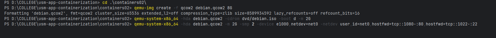
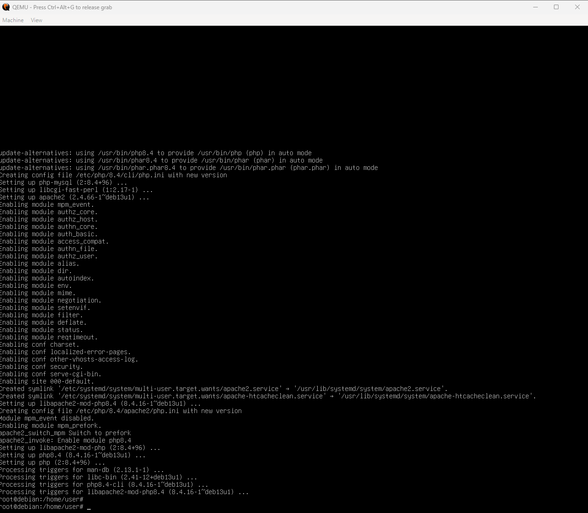
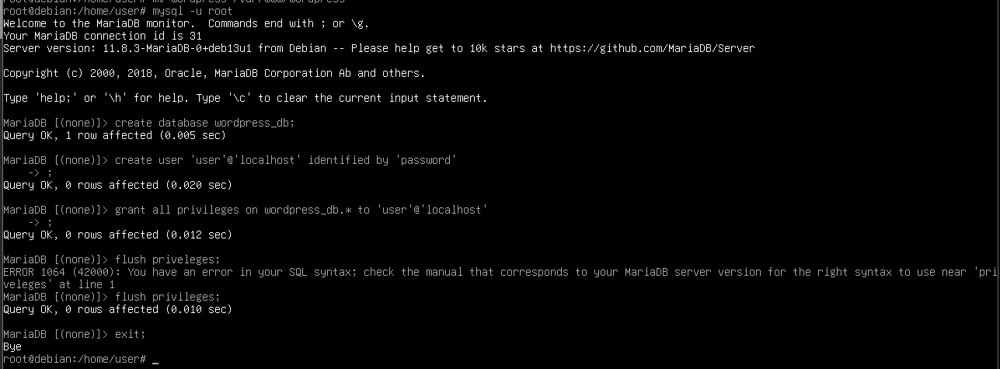
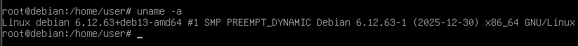
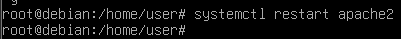
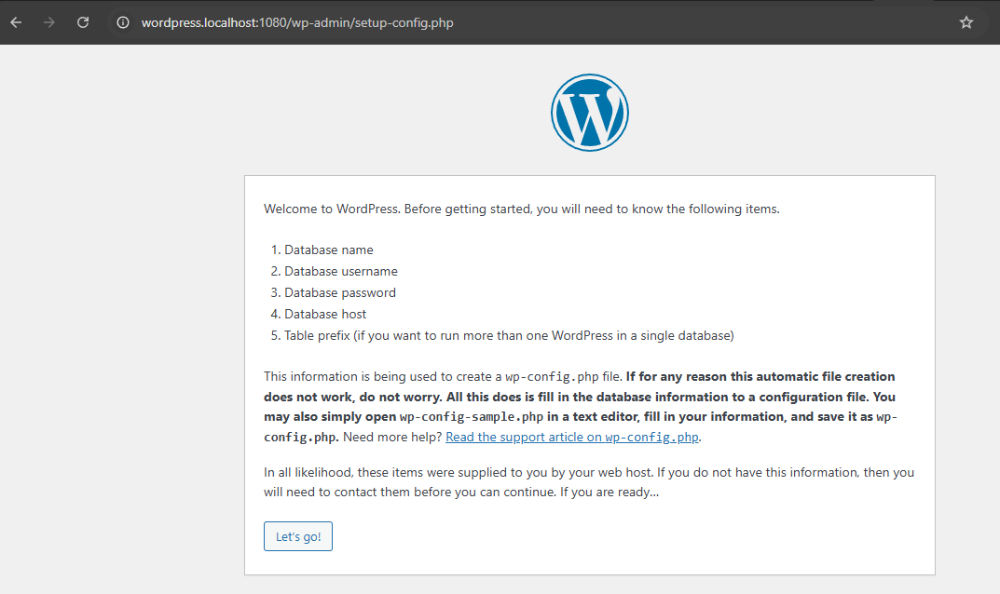
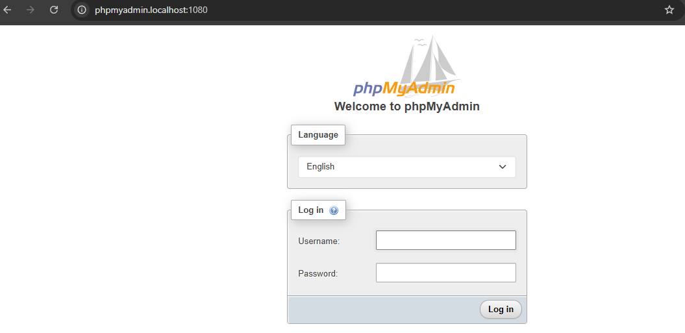

# Лабораторная работа: Containers02

## Цель работы
Изучение виртуализации операционных систем на примере Debian и настройка виртуального HTTP сервера (LAMP).

## Задание
Установить ОС Debian в QEMU, настроить LAMP-сервер и развернуть PhpMyAdmin и WordPress.

## Описание выполнения работы

### 1. Установка QEMU и подготовка образа
Установлен гипервизор QEMU и скачан ISO-образ Debian.



### 2. Создание виртуального диска
**Команда:**
```bash
qemu-img create -f qcow2 debian.qcow2 8G
```

**Назначение:** Создание виртуального диска формата qcow2 размером 8 ГБ.

### 3. Установка Debian
**Команда запуска установки:**
```bash
qemu-system-x86_64 -hda debian.qcow2 -cdrom dvd/debian.iso -boot d -m 2G
```

**Параметры установки:**
- Имя компьютера: debian
- Хостовое имя: debian.localhost
- Пользователь: user / password

### 4. Запуск виртуальной машины
**Команда:**
```bash
qemu-system-x86_64 -hda debian.qcow2 -m 2G -smp 2 -device e1000,netdev=net0 -netdev user,id=net0,hostfwd=tcp::1080-:80,hostfwd=tcp::1022-:22
```

**Параметры:**
- `-m 2G` - выделение 2 ГБ оперативной памяти
- `-smp 2` - использование 2 процессорных ядер
- `hostfwd=tcp::1080-:80` - проброс порта 80 на хост-порт 1080
- `hostfwd=tcp::1022-:22` - проброс порта 22 на хост-порт 1022

### 5. Установка LAMP
**Команды:**
```bash
su
apt update -y
apt install -y apache2 php libapache2-mod-php php-mysql mariadb-server mariadb-client unzip
```

**Вопрос: Какое назначение установленных пакетов?**

**Ответ:**
- `apache2` - веб-сервер Apache
- `php` - интерпретатор PHP
- `libapache2-mod-php` - модуль интеграции PHP с Apache
- `php-mysql` - драйвер для работы PHP с MySQL/MariaDB
- `mariadb-server` - сервер СУБД MariaDB
- `mariadb-client` - клиент для работы с MariaDB
- `unzip` - утилита для распаковки ZIP-архивов



### 6. Скачивание и распаковка PhpMyAdmin и WordPress
**Команды:**
```bash
wget https://files.phpmyadmin.net/phpMyAdmin/5.2.2/phpMyAdmin-5.2.2-all-languages.zip
wget https://wordpress.org/latest.zip
mkdir /var/www
unzip phpMyAdmin-5.2.2-all-languages.zip
mv phpMyAdmin-5.2.2-all-languages /var/www/phpmyadmin
unzip latest.zip
mv wordpress /var/www/wordpress
```


### 7. Создание базы данных
**Команды:**
```bash
mysql -u root
CREATE DATABASE wordpress_db;
CREATE USER 'user'@'localhost' IDENTIFIED BY 'password';
GRANT ALL PRIVILEGES ON wordpress_db.* TO 'user'@'localhost';
FLUSH PRIVILEGES;
EXIT;
```



### 8. Настройка виртуальных хостов Apache
**Файл `/etc/apache2/sites-available/01-phpmyadmin.conf`:**
```apache
<VirtualHost *:80>
    ServerAdmin webmaster@localhost
    DocumentRoot "/var/www/phpmyadmin"
    ServerName phpmyadmin.localhost
    ServerAlias www.phpmyadmin.localhost
    ErrorLog "/var/log/apache2/phpmyadmin.localhost-error.log"
    CustomLog "/var/log/apache2/phpmyadmin.localhost-access.log" common
</VirtualHost>
```

**Файл `/etc/apache2/sites-available/02-wordpress.conf`:**
```apache
<VirtualHost *:80>
    ServerAdmin webmaster@localhost
    DocumentRoot "/var/www/wordpress"
    ServerName wordpress.localhost
    ServerAlias www.wordpress.localhost
    ErrorLog "/var/log/apache2/wordpress.localhost-error.log"
    CustomLog "/var/log/apache2/wordpress.localhost-access.log" common
</VirtualHost>
```

**Регистрация сайтов:**
```bash
/usr/sbin/a2ensite 01-phpmyadmin
/usr/sbin/a2ensite 02-wordpress
```

**Добавление записей в `/etc/hosts`:**
```
127.0.0.1 phpmyadmin.localhost
127.0.0.1 wordpress.localhost
```

## Запуск и тестирование

### Проверка системы
**Команда:**
```bash
uname -a
```

**Вопрос: Что выводится на экране?**

**Ответ:**
```
Linux debian 6.12.63+deb13-amd64 #1 SMP PREEMPT DYNAMIC Debian 6.12.63-1 (2025-12-30) x86_64 GNU/Linux
```

Вывод показывает:
- Имя системы: Linux debian
- Версия ядра: 6.12.63+deb13-amd64
- Архитектура: x86_64 (64-битная)



### Перезагрузка Apache
**Вопрос: Как перезагрузить Apache Web Server?**

**Ответ:**
```bash
service apache2 restart
```
или
```bash
systemctl restart apache2
```



### Проверка сайтов
Сайты доступны по адресам:
- `http://wordpress.localhost:1080`
- `http://phpmyadmin.localhost:1080`





## Ответы на вопросы

### 1. Каким образом можно скачать файл в консоли при помощи утилиты wget?
```bash
wget URL
```
Например: `wget https://example.com/file.zip`

### 2. Зачем необходимо создавать для каждого сайта свою базу и своего пользователя?
- **Безопасность:** изоляция данных разных приложений
- **Ограничение прав:** пользователь имеет доступ только к своей БД
- **Упрощение управления:** при компрометации одного сайта другие остаются защищены

### 3. Как поменять доступ к системе управления БД на порт 1234?
При запуске QEMU изменить параметр проброса порта:
```bash
hostfwd=tcp::1234-:80
```
И обращаться через `http://phpmyadmin.localhost:1234`

### 4. Какие преимущества даёт виртуализация?
- **Изоляция:** независимость систем друг от друга
- **Экономия ресурсов:** запуск нескольких ОС на одном физическом сервере
- **Безопасность:** сбой в виртуальной машине не влияет на хост
- **Тестирование:** возможность быстро развернуть и удалить окружение
- **Снимки состояния:** возможность откатиться к предыдущему состоянию системы

### 5. Для чего необходимо устанавливать время / временную зону на сервере?
- Корректное время в логах для анализа событий
- Правильная работа планировщика задач (cron)
- Синхронизация с другими серверами
- Корректная работа SSL-сертификатов
- Точность временных меток в базе данных

### 6. Сколько места занимает установленная ОС на хостовой машине?
Файл `debian.qcow2` занимает столько места, сколько реально используется внутри виртуальной машины (формат qcow2 использует динамическое выделение). Типичный размер после установки LAMP: 2-4 ГБ.

### 7. Какие есть рекомендации по разбиению диска для серверов?
**Рекомендуемая схема разделов:**
- `/` - корневая система (10-20 ГБ)
- `/boot` - загрузчик (500 МБ - 1 ГБ)
- `/home` - домашние каталоги пользователей
- `/var` - логи, базы данных, кеш
- `/tmp` - временные файлы
- `swap` - раздел подкачки (1-2x RAM)

**Причины:**
- **Безопасность:** переполнение `/tmp` или `/var` не заблокирует корневую систему
- **Производительность:** разные разделы можно монтировать с разными опциями (noexec для /tmp)
- **Резервное копирование:** возможность делать бэкап только критичных разделов
- **Восстановление:** проще восстановить систему при повреждении одного раздела

## Выводы

В ходе лабораторной работы:

1. Освоена работа с гипервизором QEMU для создания и управления виртуальными машинами
2. Установлена и настроена ОС Debian в виртуальном окружении
3. Развернут LAMP-сервер (Linux + Apache + MySQL/MariaDB + PHP)
4. Настроены виртуальные хосты Apache для работы с несколькими сайтами на одном сервере
5. Установлены и запущены PhpMyAdmin и WordPress
6. Изучен проброс портов для доступа к сервисам виртуальной машины с хост-системы

Виртуализация позволяет безопасно экспериментировать с серверными конфигурациями без риска для основной системы.

## Используемые источники

1. [QEMU Documentation](https://www.qemu.org/documentation/)
2. [Debian Installation Guide](https://www.debian.org/releases/stable/installmanual)
3. [Apache Virtual Host Documentation](https://httpd.apache.org/docs/2.4/vhosts/)
4. [MariaDB Documentation](https://mariadb.org/documentation/)
5. [PhpMyAdmin Documentation](https://docs.phpmyadmin.net/)
6. [WordPress Installation Guide](https://wordpress.org/support/article/how-to-install-wordpress/)

