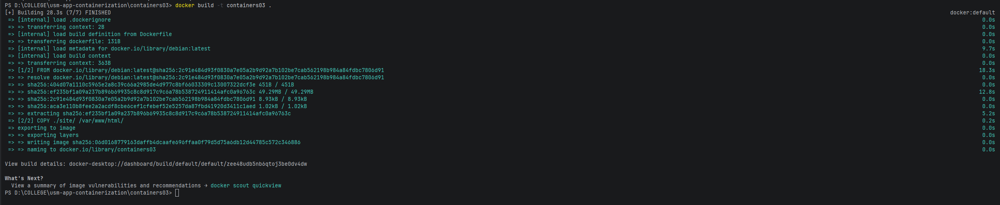
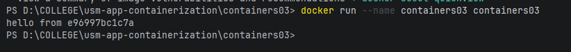
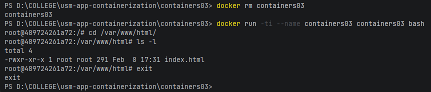

# Лабораторная работа: Containers03

## Цель работы

Изучение основ работы с Docker: создание Dockerfile, сборка образов, запуск контейнеров и работа с файловой системой внутри контейнера.

## Задание

1. Создать репозиторий `containers03` и склонировать его на компьютер.
2. Создать `Dockerfile` со следующим содержимым:
   ```dockerfile
   FROM debian:latest
   COPY ./site/ /var/www/html/
   CMD ["sh", "-c", "echo hello from $HOSTNAME"]
   ```
3. Создать папку `site` с файлом `index.html` с произвольным содержимым.
4. Собрать Docker образ �� запустить контейнер.
5. Протестировать работу контейнера и проверить файловую систему.

## Описание выполнения работы

### 1. Создание структуры проекта

Создана следующая структура проекта:
```
containers03/
├── Dockerfile
├── README.md
├── images/
│   ├── 1-docker-build-output.png
│   ├── 2-docker-run-output.png
│   └── 3-docker-exec-ls-output.png
└── site/
    └── index.html
```

### 2. Создание Dockerfile

В файле `Dockerfile` указаны следующие инструкции:
- `FROM debian:latest` - использование базового образа Debian последней версии
- `COPY ./site/ /var/www/html/` - копирование содержимого папки site в директорию /var/www/html/ внутри контейнера
- `CMD ["sh", "-c", "echo hello from $HOSTNAME"]` - команда по умолчанию, которая выводит приветствие с именем хоста

### 3. Создание HTML файла

В папке `site` создан файл `index.html` с базовой HTML структурой.

### 4. Сборка Docker образа

**Команда:**
```bash
docker build -t containers03 .
```

**Вопрос: Сколько времени создавался образ?**

**Ответ:** Образ создавался **28.3 секунды**.

Вывод команды показал:
```
[+] Building 28.3s (7/7) FINISHED
```



### 5. Запуск контейнера

**Команда:**
```bash
docker run --name containers03 containers03
```

**Вопрос: Что было выведено в консоли?**

**Ответ:** В консоли было выведено:
```
hello from e96997bc1c7a
```

Где `e96997bc1c7a` - это hostname контейнера (уникальный идентификатор).



### 6. Проверка файловой системы контейнера

Удален предыдущий контейнер и запущен новый в интерактивном режиме:

**Команды:**
```bash
docker rm containers03
docker run -ti --name containers03 containers03 bash
```

Внутри контейнера выполнены команды:
```bash
cd /var/www/html/
ls -l
```

**Вопрос: Что выводится на экране?**

**Ответ:** Вывод команды `ls -l`:
```
total 4
-rwxr-xr-x 1 root root 291 Feb  8 17:31 index.html
```

Это показывает, что файл `index.html` успешно скопирован в контейнер:
- Права доступа: `-rwxr-xr-x` (чтение, запись, выполнение для владельца; чтение и выполнение для группы и остальных)
- Владелец: `root root`
- Размер: 291 байт
- Дата создания: 8 февраля, 17:31
- Имя файла: `index.html`



Контейнер закрыт командой `exit`.

## Выводы

В ходе выполнения лабораторной работы были изучены следующие аспекты работы с Docker:

1. **Создание Dockerfile** - научились описывать конфигурацию образа с использованием базовых инструкций (FROM, COPY, CMD).

2. **Сборка образа** - использовали команду `docker build` для создания образа из Dockerfile. Процесс сборки занял 28.3 секунды.

3. **Запуск контейнеров** - освоили различные способы запуска контейнеров:
   - Обычный запуск с выполнением команды по умолчанию
   - Интерактивный режим с доступом к bash

4. **Работа с файловой системой** - убедились, что инструкция COPY корректно копирует файлы из хост-системы в контейнер, и они доступны по указанному пути.

5. **Переменные окружения** - узнали, что внутри контейнера доступны переменные окружения, такие как `$HOSTNAME`, которые содержат уникальный идентификатор контейнера.

Практическая работа показала, что Docker позволяет создавать изолированные окружения с предустановленными файлами и настройками, что является основой для контейнеризации приложений.

## Используемые источники

1. [Официальная документация Docker](https://docs.docker.com/)
2. [Docker Dockerfile Reference](https://docs.docker.com/engine/reference/builder/)
3. [Debian Docker Hub](https://hub.docker.com/_/debian)
4. [Docker CLI Reference](https://docs.docker.com/engine/reference/commandline/cli/)

