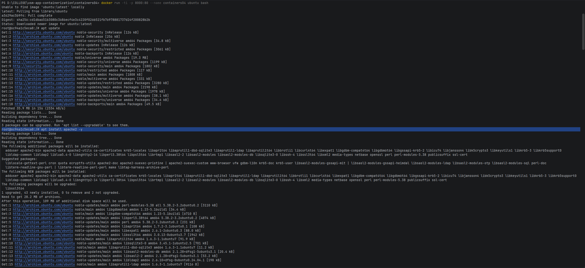
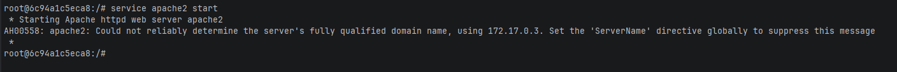
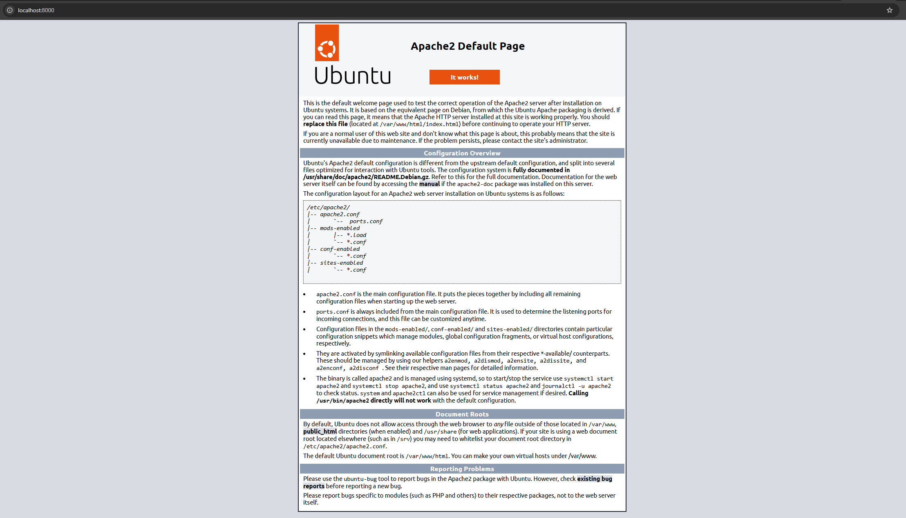
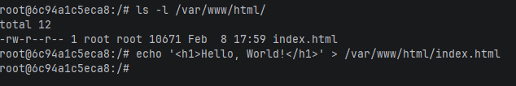
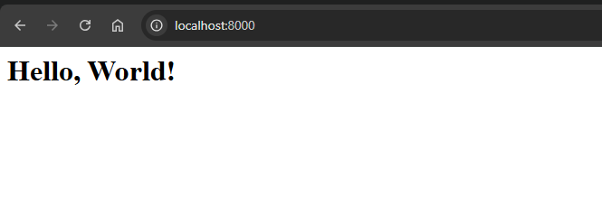
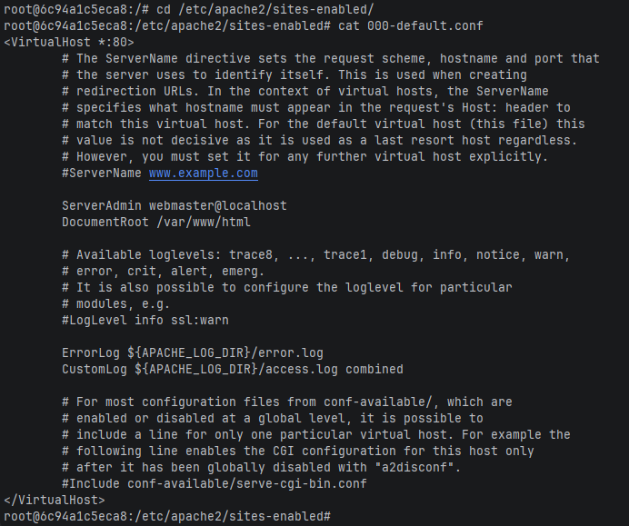
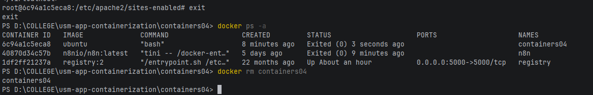

# Лабораторная работа: Containers04

## Цель работы

Изучение работы с Docker-контейнерами на практике: запуск контейнера Ubuntu, установка и настройка веб-сервера Apache, проброс портов и работа с файловой системой контейнера.

## Задание

Запустить контейнер Ubuntu, установить Web-сервер Apache и вывести в браузере страницу с текстом "Hello, World!".

## Описание выполнения работы

### 1. Запуск контейнера Ubuntu

**Команда:**
```bash
docker run -ti -p 8000:80 --name containers04 ubuntu bash
```

**Назначение:** Запуск интерактивного контейнера Ubuntu с пробросом портов.

**Параметры:**
- `-ti` - интерактивный режим с подключением терминала
- `-p 8000:80` - проброс порта 80 контейнера на порт 8000 хоста
- `--name containers04` - имя контейнера
- `ubuntu` - базовый образ
- `bash` - команда запуска shell



### 2. Обновление списка пакетов

**Команда:**
```bash
apt update
```

**Назначение:** Обновление индекса пакетов APT для получения информации о новых версиях пакетов.

**Результат:** Загружен список доступных пакетов из репозиториев Ubuntu.

### 3. Установка Apache2

**Команда:**
```bash
apt install apache2 -y
```

**Назначение:** Установка веб-сервера Apache2.

**Параметры:**
- `-y` - автоматическое подтверждение установки

**Результат:** Apache2 и все необходимые зависимости установлены в контейнер.

### 4. Запуск службы Apache2

**Команда:**
```bash
service apache2 start
```

**Назначение:** Запуск веб-сервера Apache2.

**Результат:** Веб-сервер успешно запущен и слушает на порту 80.



### 5. Проверка работы Apache

**Действие:** Открыт браузер по адресу `http://localhost:8000`

**Вопрос: Что вы видите?**

**Ответ:** Отображается стандартная страница Apache "Apache2 Ubuntu Default Page" с текстом "It works!".



### 6. Просмотр содержимого веб-директории

**Команда:**
```bash
ls -l /var/www/html/
```

**Назначение:** Вывод списка файлов в директории веб-сервера.

**Результат:** В директории находится файл `index.html` размером 10918 байт (стандартная страница Apache).

### 7. Создание собственной страницы

**Команда:**
```bash
echo '<h1>Hello, World!</h1>' > /var/www/html/index.html
```

**Назначение:** Перезапись файла index.html собственным содержимым.

**Результат:** Файл `index.html` заменен на простую HTML-страницу с текстом "Hello, World!".



### 8. Проверка изменений в браузере

**Действие:** Обновлена страница `http://localhost:8000` в браузере.

**Вопрос: Что вы видите?**

**Ответ:** Отображается заголовок "Hello, World!".



### 9. Просмотр конфигурации Apache

**Команды:**
```bash
cd /etc/apache2/sites-enabled/
cat 000-default.conf
```

**Назначение:** Просмотр конфигурации виртуального хоста по умолчанию.

**Вопрос: Что вы видите на экране?**

**Ответ:** Конфигурационный файл виртуального хоста.

**Ключевые параметры:**
- `*:80` - сервер слушает на всех интерфейсах на порту 80
- `DocumentRoot /var/www/html` - корневая директория веб-сайта
- Настройки логов ошибок и доступа



### 10. Просмотр списка контейнеров

**Команда:**
```bash
docker ps -a
```

**Назначение:** Вывод списка всех контейнеров (включая остановленные).

### 11. Удаление контейнера

**Команда:**
```bash
docker rm containers04
```

**Назначение:** Удаление остановленного контейнера.

**Результат:** Контейнер успешно удален из системы.



## Выводы

В ходе лабораторной работы изучены следующие аспекты:

1. **Проброс портов** - параметр `-p` позволяет связать порт контейнера с портом хоста, обеспечивая доступ к сервисам извне.

2. **Установка ПО в контейнер** - контейнеры можно использовать как полноценные системы для установки и настройки программного обеспечения.

3. **Работа с Apache2** - установлен и запущен веб-сервер, изучена его структура директорий и конфигурационные файлы.

4. **Модификация контента** - изменен файл index.html, что немедленно отразилось в браузере без перезапуска сервера.

5. **Конфигурация виртуальных хостов** - файл `000-default.conf` определяет основные параметры работы веб-сервера (порт, корневая директория, логи).

6. **Жизненный цикл контейнера** - контейнер останавливается при выходе из shell и может быть удален командой `docker rm`.

Практическая работа продемонстрировала возможность быстрого развертывания веб-сервера в изолированном окружении без влияния на хост-систему.

## Используемые источники

1. [Docker Documentation](https://docs.docker.com/)
2. [Apache HTTP Server Documentation](https://httpd.apache.org/docs/)
3. [Ubuntu Docker Hub](https://hub.docker.com/_/ubuntu)
4. [Docker CLI Reference](https://docs.docker.com/engine/reference/commandline/cli/)

