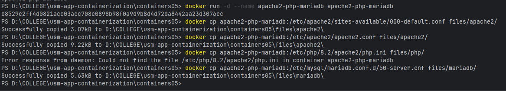
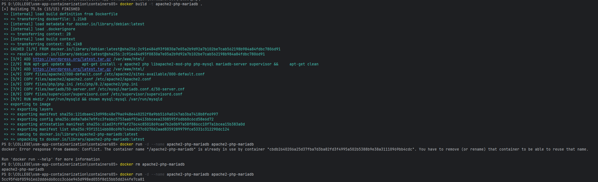
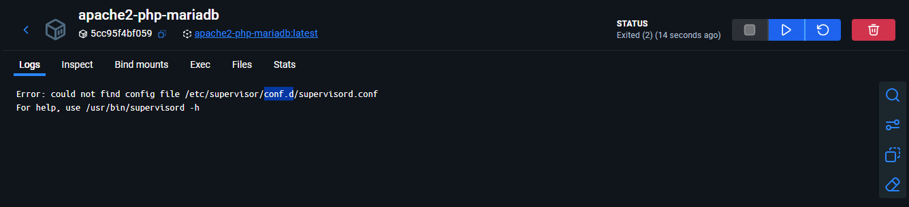
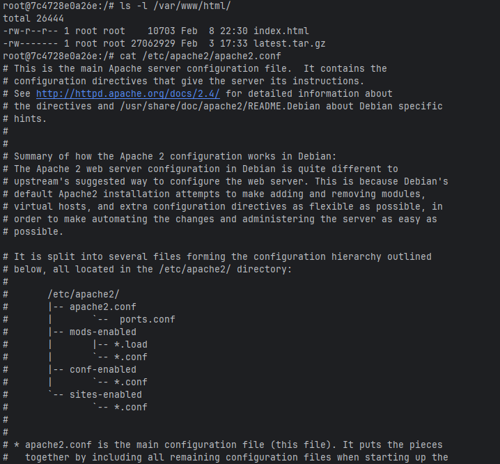
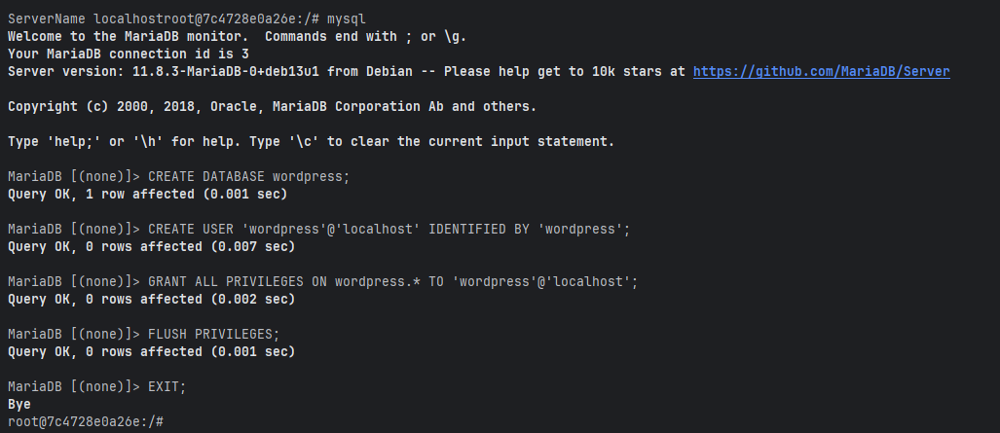
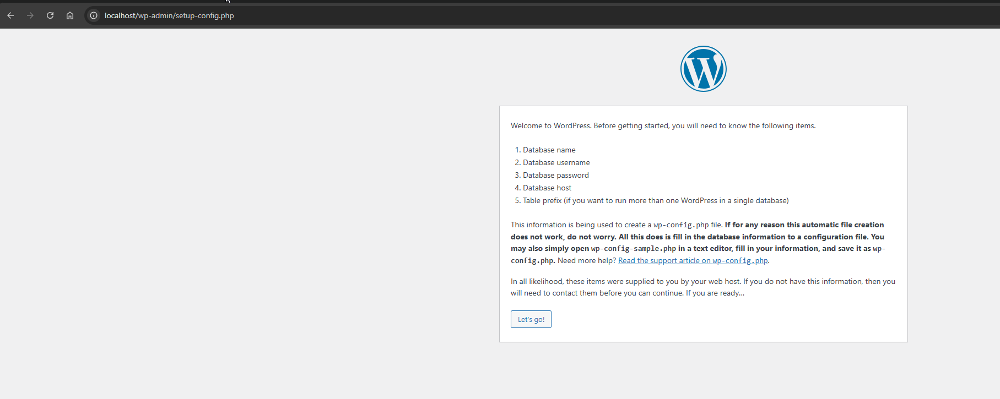
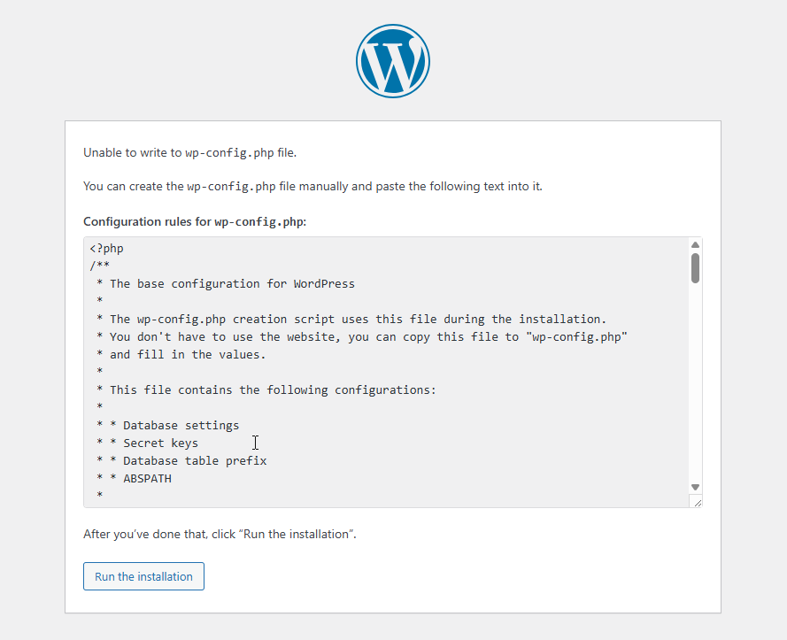

# Лабораторная работа №5 — Apache + PHP + MariaDB в Docker-контейнере

## Цель работы

Создать Docker-образ с веб-стеком Apache HTTP Server + PHP (mod_php) + MariaDB, развернуть в нём WordPress и убедиться в его работоспособности.

## Задание

Создать `Dockerfile`, который:

- устанавливает Apache2, PHP, MariaDB и Supervisor;
- монтирует тома для данных БД и логов;
- скачивает и распаковывает WordPress в `/var/www/html`;
- копирует заранее подготовленные конфигурационные файлы;
- запускает оба сервиса через Supervisor.

---

## Выполнение

### 1. Извлечение конфигурационных файлов

Создан базовый `Dockerfile` с установкой пакетов, собран образ, запущен контейнер. Из контейнера скопированы конфигурационные файлы в папку `files/`:

```bash
docker cp apache2-php-mariadb:/etc/apache2/sites-available/000-default.conf files/apache2/
docker cp apache2-php-mariadb:/etc/apache2/apache2.conf files/apache2/
docker cp apache2-php-mariadb:/etc/php/8.2/apache2/php.ini files/php/
docker cp apache2-php-mariadb:/etc/mysql/mariadb.conf.d/50-server.cnf files/mariadb/
```



---

### 2. Настройка конфигурационных файлов

**`files/apache2/000-default.conf`** — раскомментировано `ServerName localhost`, изменён `ServerAdmin`, добавлена строка:
```
DirectoryIndex index.php index.html
```

**`files/apache2/apache2.conf`** — в конец файла добавлено:
```
ServerName localhost
```

**`files/php/php.ini`** — настроены параметры:
```ini
error_log = /var/log/php_errors.log
memory_limit = 128M
upload_max_filesize = 128M
post_max_size = 128M
max_execution_time = 120
```

**`files/mariadb/50-server.cnf`** — раскомментирована строка:
```
log_error = /var/log/mysql/error.log
```

---

### 3. Создание supervisord.conf

Создан файл `files/supervisor/supervisord.conf` для запуска Apache и MariaDB как двух процессов под управлением Supervisor.

**Исправление по сравнению с оригинальным заданием:** добавлен параметр `stderr_logfile_maxbytes=0` для каждой программы — без него Supervisor пытается ротировать `/proc/self/fd/2`, что приводит к ошибкам.

```ini
[supervisord]
nodaemon=true
logfile=/dev/null
user=root

[program:apache2]
command=/usr/sbin/apache2ctl -D FOREGROUND
autostart=true
autorestart=true
startretries=3
stderr_logfile=/proc/self/fd/2
stderr_logfile_maxbytes=0
user=root

[program:mariadb]
command=/usr/sbin/mariadbd --user=mysql
autostart=true
autorestart=true
startretries=3
stderr_logfile=/proc/self/fd/2
stderr_logfile_maxbytes=0
user=mysql
```

---

### 4. Dockerfile

**Исправление по сравнению с оригинальным заданием:** инструкция `ADD` в Docker автоматически распаковывает только **локальные** архивы — URL-архивы просто скачиваются как файлы. Поэтому WordPress скачивается и распаковывается явно с флагом `--strip-components=1`, чтобы файлы оказались прямо в `/var/www/html`, а не во вложенной папке `wordpress/`.

Итоговый `Dockerfile`:

```dockerfile
FROM debian:latest

RUN apt-get update && \
    apt-get install -y apache2 php libapache2-mod-php php-mysql mariadb-server supervisor && \
    apt-get clean

VOLUME /var/lib/mysql
VOLUME /var/log

ADD https://wordpress.org/latest.tar.gz /var/www/html/
RUN rm -f /var/www/html/index.html && \
    tar -xzf /var/www/html/latest.tar.gz --strip-components=1 -C /var/www/html && \
    rm /var/www/html/latest.tar.gz

COPY files/apache2/000-default.conf /etc/apache2/sites-available/000-default.conf
COPY files/apache2/apache2.conf /etc/apache2/apache2.conf
COPY files/php/php.ini /etc/php/8.2/apache2/php.ini
COPY files/mariadb/50-server.cnf /etc/mysql/mariadb.conf.d/50-server.cnf
COPY files/mariadb/init.sql /etc/mysql/mariadb.conf.d/init.sql
COPY files/supervisor/supervisord.conf /etc/supervisor/conf.d/supervisord.conf

RUN mkdir /var/run/mysqld && chown mysql:mysql /var/run/mysqld

COPY files/wp-config.php /var/www/html/wp-config.php

CMD ["/usr/bin/supervisord", "-n", "-c", "/etc/supervisor/conf.d/supervisord.conf"]
```

---

### 5. Сборка и запуск контейнера

```bash
docker build -t apache2-php-mariadb .
docker run -d --name apache2-php-mariadb -p 8000:80 apache2-php-mariadb
```

Проверены изменённые конфигурационные файлы в контейнере, наличие файлов WordPress в `/var/www/html/`.







---

### 6. Создание базы данных

Init SQL-скрипт (`files/mariadb/init.sql`) копируется в образ и выполняется в контейнере:

```sql
CREATE DATABASE IF NOT EXISTS wordpress CHARACTER SET utf8mb4 COLLATE utf8mb4_general_ci;
CREATE USER IF NOT EXISTS 'wordpress'@'localhost' IDENTIFIED BY 'wordpress';
GRANT ALL PRIVILEGES ON wordpress.* TO 'wordpress'@'localhost';
FLUSH PRIVILEGES;
```



---

### 7. Настройка WordPress и получение wp-config.php

Открыт браузер по адресу `http://localhost:8000/`, введены параметры подключения к БД. Содержимое сгенерированного `wp-config.php` скопировано в `files/wp-config.php` и добавлено в образ через `COPY`.





---

## Ответы на вопросы

**Какие файлы конфигурации были изменены?**  
`files/apache2/000-default.conf`, `files/apache2/apache2.conf`, `files/php/php.ini`, `files/mariadb/50-server.cnf`.

**За что отвечает директива `DirectoryIndex` в конфигурации Apache?**  
Задаёт список файлов, которые Apache ищет при обращении к директории без явного имени файла, и их приоритет. При настройке `DirectoryIndex index.php index.html` сервер сначала попытается отдать `index.php`, и лишь при его отсутствии — `index.html`. Это необходимо, чтобы WordPress (PHP) обрабатывался раньше статического HTML.

**Зачем нужен файл `wp-config.php`?**  
Это главный конфигурационный файл WordPress: содержит параметры подключения к базе данных (имя БД, пользователь, пароль, хост), секретные ключи аутентификации и прочие настройки приложения. Без него WordPress не запустится.

**За что отвечает параметр `post_max_size` в конфигурации PHP?**  
Ограничивает максимальный размер тела HTTP POST-запроса. Влияет в том числе на загрузку файлов: значение `post_max_size` должно быть не меньше `upload_max_filesize`, иначе большие файлы будут отклонены ещё до проверки лимита загрузки.

**Недостатки созданного образа:**

- Пароли (`wordpress`/`wordpress`) зашиты прямо в образ — недопустимо для production.
- Образ основан на теге `debian:latest` — нестабильная метка, может сломать воспроизводимость сборки.
- Все сервисы (web + db) запускаются в одном контейнере, что нарушает принцип «один процесс — один контейнер» и усложняет масштабирование.
- Данные БД хранятся в анонимном томе: при удалении контейнера без явного `-v` данные теряются.

---

## Выводы

В ходе лабораторной работы был создан Docker-образ, объединяющий Apache, PHP и MariaDB под управлением Supervisor. Освоена техника извлечения конфигурационных файлов из запущенного контейнера с их последующей настройкой и внедрением обратно через `COPY`. Установлен и настроен WordPress. В процессе выполнения выявлены два недочёта оригинального задания: необходимость явной распаковки скачанного URL-архива (инструкция `ADD` не распаковывает удалённые архивы) и обязательный параметр `stderr_logfile_maxbytes=0` для корректной работы Supervisor с псевдофайлами `/proc/self/fd/2`.

