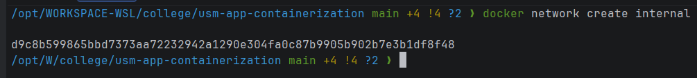
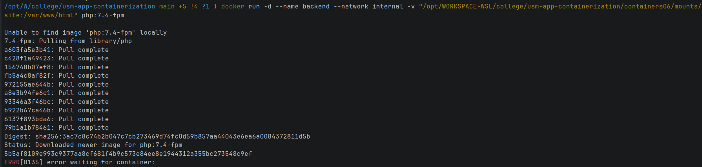
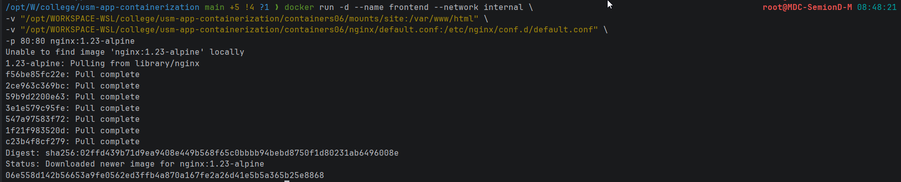
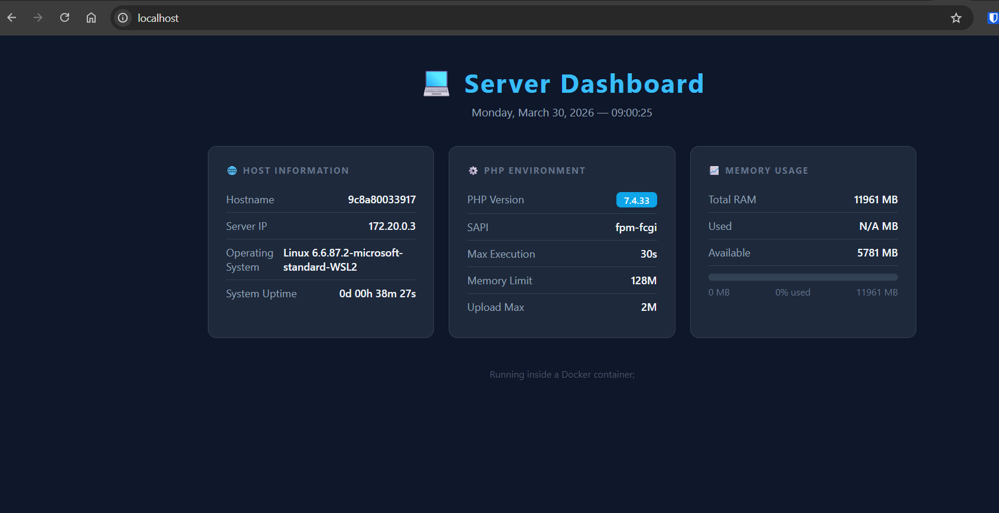

# Лабораторная работа: Containers06

## Цель работы
Выполнив данную работу студент сможет управлять взаимодействием нескольких контейнеров.

## Задание
Создать PHP-приложение, работающее на связке двух контейнеров: `nginx` (frontend) и `php-fpm` (backend), без использования Docker Compose.

## Описание выполнения работы

### 1. Подготовка директорий

Создана директория `mounts/site`, содержащая PHP-приложение. Директория добавлена в `.gitignore`, чтобы файлы сайта не попадали в репозиторий.

**Файл `.gitignore`:**
```
# Ignore files and directories
mounts/site/*
```

### 2. Конфигурация Nginx

Создан файл `nginx/default.conf`, который настраивает Nginx на работу с PHP-FPM через FastCGI:

```nginx
server {
    listen 80;
    server_name _;
    root /var/www/html;
    index index.php;
    location / {
        try_files $uri $uri/ /index.php?$args;
    }
    location ~ \.php$ {
        fastcgi_pass backend:9000;
        fastcgi_index index.php;
        fastcgi_param SCRIPT_FILENAME $document_root$fastcgi_script_name;
        include fastcgi_params;
    }
}
```

- `fastcgi_pass backend:9000` — запросы к PHP-файлам передаются контейнеру `backend` (php-fpm) на порт 9000. Имя `backend` разрешается через внутреннюю сеть Docker.

### 3. Создание сети Docker

Создана изолированная сеть `internal`, в которой работают оба контейнера:

```bash
docker network create internal
```



**Вопрос: зачем нужна отдельная сеть?**

**Ответ:** Отдельная пользовательская сеть позволяет контейнерам обращаться друг к другу по именам (DNS-разрешение имён контейнеров). В сети по умолчанию (`bridge`) DNS по именам контейнеров не работает. Кроме того, изоляция повышает безопасность.

### 4. Создание контейнера backend (PHP-FPM)

```bash
docker run -d --name backend --network internal "/opt/WORKSPACE-WSL/college/usm-app-containerization/containers06/mounts/site:/var/www/html" php:7.4-fpm
```

**Параметры:**
- `-d` — запуск в фоновом режиме (detached)
- `--name backend` — имя контейнера, по которому к нему обращается nginx
- `--network internal` — подключение к сети `internal`
- `-v "/opt/WORKSPACE-WSL/college/usm-app-containerization/containers06/mounts/site:/var/www/html"` — монтирование директории с сайтом внутрь контейнера
- `php:7.4-fpm` — образ PHP с предустановленным PHP-FPM



### 5. Создание контейнера frontend (Nginx)

```bash
docker run -d \
  --name frontend \
  --network internal \
  -v "/opt/WORKSPACE-WSL/college/usm-app-containerization/containers06/mounts/site:/var/www/html" \
  -v "/opt/WORKSPACE-WSL/college/usm-app-containerization/containers06/nginx/default.conf:/etc/nginx/conf.d/default.conf" \
  -p 80:80 \
  nginx:1.23-alpine
```

**Параметры:**
- `--name frontend` — имя контейнера
- `--network internal` — та же сеть, что и у backend
- `-v "$(pwd)/mounts/site:/var/www/html"` — монтирование директории сайта (для статических файлов)
- `-v "$(pwd)/nginx/default.conf:/etc/nginx/conf.d/default.conf"` — монтирование конфига Nginx
- `-p 80:80` — проброс порта 80 контейнера на порт 80 хоста
- `nginx:1.23-alpine` — лёгкий образ Nginx на Alpine Linux



## Запуск и тестирование

### Шаги запуска

```bash
# 1. Создать сеть
docker network create internal

# 2. Запустить backend (php-fpm)
docker run -d --name backend --network internal "/opt/WORKSPACE-WSL/college/usm-app-containerization/containers06/mounts/site:/var/www/html" php:7.4-fpm

# 3. Запустить frontend (nginx)
docker run -d \
  --name frontend \
  --network internal \
  -v "$(pwd)/mounts/site:/var/www/html" \
  -v "$(pwd)/nginx/default.conf:/etc/nginx/conf.d/default.conf" \
  -p 80:80 \
  nginx:1.23-alpine
```

### Проверка работы

После запуска в браузере по адресу:
```
http://localhost
```

Отображается: 




## Ответы на вопросы

**Каким образом в данном примере контейнеры могут взаимодействовать друг с другом?**

Контейнеры взаимодействуют через пользовательскую сеть Docker типа `bridge` с именем `internal`. Оба контейнера — `frontend` (nginx) и `backend` (php-fpm) — подключены к этой сети с помощью параметра `--network internal`. Благодаря этому они находятся в одном сетевом пространстве и могут обмениваться данными по внутренним IP-адресам или по DNS-именам. Nginx принимает HTTP-запросы снаружи (порт 80) и для обработки `.php`-файлов передаёт их контейнеру `backend` через протокол FastCGI (`fastcgi_pass backend:9000`).

**Как видят контейнеры друг друга в рамках сети internal?**

В пользовательской сети Docker автоматически работает встроенный DNS-сервер. Каждый контейнер регистрируется в этом DNS под своим именем (задаётся параметром `--name`). Поэтому контейнер `frontend` может обратиться к контейнеру `backend` просто по имени `backend`, а не по IP-адресу. Имя разрешается во внутренний IP-адрес контейнера внутри сети `internal`. Это делает конфигурацию стабильной — IP-адреса контейнеров могут меняться при перезапуске, а имена остаются постоянными.

**Почему необходимо было переопределять конфигурацию nginx?**

Стандартная конфигурация nginx (файл `/etc/nginx/conf.d/default.conf` в образе `nginx:1.23-alpine`) умеет отдавать только статические файлы и не знает о PHP-FPM. Чтобы nginx мог передавать `.php`-запросы на обработку в контейнер `backend`, необходимо добавить блок `location ~ \.php$` с директивой `fastcgi_pass backend:9000` и параметрами FastCGI (`fastcgi_param SCRIPT_FILENAME`, `include fastcgi_params`). Без этой конфигурации nginx бы отдавал `.php`-файлы как простой текст или возвращал ошибку 403/404, не выполняя PHP-код.

## Выводы

В ходе лабораторной работы:

1. Изучен принцип взаимодействия контейнеров через пользовательские Docker-сети.
2. Настроена связка **Nginx + PHP-FPM** — стандартная архитектура для высоконагруженных PHP-приложений.
3. Освоено монтирование томов (`-v`) для обмена данными между хостом и контейнерами.
4. Изучена конфигурация Nginx для работы с FastCGI и PHP-FPM.
5. Получен практический опыт управления несколькими контейнерами без использования Docker Compose.

## Используемые источники

1. [Docker Documentation — Networking](https://docs.docker.com/network/)
2. [Nginx Documentation](https://nginx.org/en/docs/)
3. [PHP-FPM Documentation](https://www.php.net/manual/en/install.fpm.php)
4. [Docker Hub — php:7.4-fpm](https://hub.docker.com/_/php)
5. [Docker Hub — nginx:1.23-alpine](https://hub.docker.com/_/nginx)


