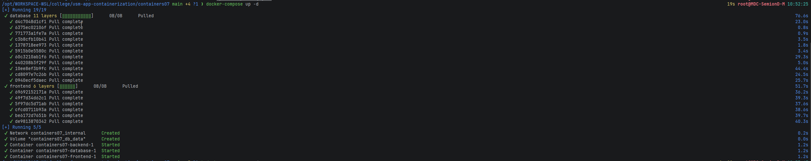
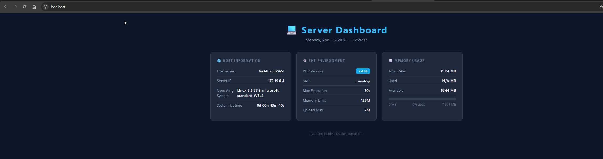
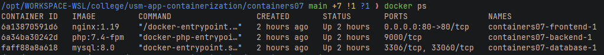

# Лабораторная работа №7: Создание многоконтейнерного приложения

## Цель работы
Ознакомиться с работой многоконтейнерного приложения на базе docker-compose.

## Задание
Создать php-приложение на базе трёх контейнеров: **nginx**, **php-fpm**, **mariadb**, используя docker-compose.

## Выполнение

### 1. Конфигурация nginx (`nginx/default.conf`)

```nginx
server {
    listen 80;
    server_name _;
    root /var/www/html;
    index index.php;
    location / {
        try_files $uri $uri/ /index.php?$args;
    }
    location ~ \.php$ {
        fastcgi_pass backend:9000;
        fastcgi_index index.php;
        fastcgi_param SCRIPT_FILENAME $document_root$fastcgi_script_name;
        include fastcgi_params;
    }
}
```

### 2. Файл `docker-compose.yml`

```yaml
version: '3.9'

services:
  frontend:
    image: nginx:1.19
    volumes:
      - ./mounts/site:/var/www/html
      - ./nginx/default.conf:/etc/nginx/conf.d/default.conf
    ports:
      - "80:80"
    networks:
      - internal
  backend:
    image: php:7.4-fpm
    volumes:
      - ./mounts/site:/var/www/html
    networks:
      - internal
    env_file:
      - mysql.env
  database:
    image: mysql:8.0
    env_file:
      - mysql.env
    networks:
      - internal
    volumes:
      - db_data:/var/lib/mysql

networks:
  internal: {}

volumes:
  db_data: {}
```

### 3. Файл `mysql.env`

```env
MYSQL_ROOT_PASSWORD=secret
MYSQL_DATABASE=app
MYSQL_USER=user
MYSQL_PASSWORD=secret
```

### 4. Запуск

```bash
docker-compose up -d
```



После запуска сайт доступен по адресу `http://localhost`:



## Ответы на вопросы

**В каком порядке запускаются контейнеры?**  
Docker Compose запускает контейнеры в порядке, определённом в файле `docker-compose.yml`, без явного указания зависимостей. В данном случае порядок: `frontend` → `backend` → `database`. Для управления порядком используется директива `depends_on`.

**Где хранятся данные базы данных?**  
Данные хранятся в именованном томе `db_data`, который монтируется в директорию `/var/lib/mysql` контейнера `database`. Docker управляет этим томом на хосте.

**Как называются контейнеры проекта?**  
По умолчанию Docker Compose именует контейнеры по шаблону `<папка_проекта>-<имя_сервиса>-1`. В данном случае:
- `containers07-frontend-1`
- `containers07-backend-1`
- `containers07-database-1`



**Как добавить файл `app.env` с переменной `APP_VERSION` для сервисов `backend` и `frontend`?**  
Создать файл `app.env`:
```env
APP_VERSION=1.0.0
```
И добавить его в секцию `env_file` нужных сервисов в `docker-compose.yml`:
```yaml
  frontend:
    ...
    env_file:
      - app.env
  backend:
    ...
    env_file:
      - mysql.env
      - app.env
```

## Выводы

В ходе работы было создано многоконтейнерное php-приложение с использованием Docker Compose. Три сервиса (nginx, php-fpm, mysql) взаимодействуют внутри общей сети `internal`. Монтирование томов обеспечивает доступ к файлам сайта для `frontend` и `backend`, а именованный том `db_data` гарантирует сохранность данных базы данных между перезапусками контейнеров.

