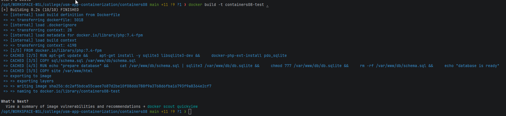
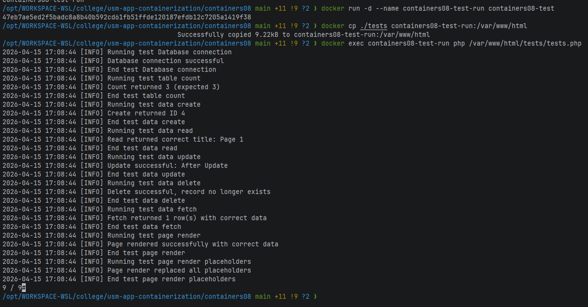
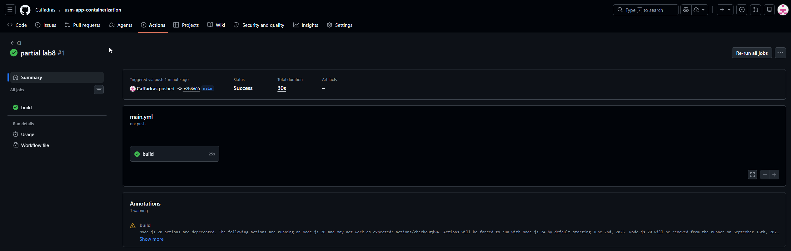

# Лабораторная работа №8. Непрерывная интеграция с помощью Github Actions

## Цель работы

Научиться настраивать непрерывную интеграцию с помощью Github Actions на базе контейнеров.

## Задание

Создать Web приложение на PHP с использованием SQLite, написать юнит-тесты и настроить CI-пайплайн с помощью Github
Actions.

## Описание выполнения работы

### Создание Web приложения

Реализован класс `Database` для работы с SQLite через PDO со следующими методами: `__construct`, `Execute`, `Fetch`,
`Create`, `Read`, `Update`, `Delete`, `Count`. Класс `Page` принимает путь к шаблону и выполняет подстановку переменных
через метод `Render`.

```php
<?php

class Database {
    private $pdo;

    public function __construct($path) {
        $this->pdo = new PDO("sqlite:" . $path);
        $this->pdo->setAttribute(PDO::ATTR_ERRMODE, PDO::ERRMODE_EXCEPTION);
        $this->pdo->setAttribute(PDO::ATTR_DEFAULT_FETCH_MODE, PDO::FETCH_ASSOC);
    }

    public function Execute($sql) {
        return $this->pdo->exec($sql);
    }

    public function Fetch($sql) {
        $stmt = $this->pdo->query($sql);
        return $stmt->fetchAll(PDO::FETCH_ASSOC);
    }

    public function Create($table, $data) {
        $columns = implode(', ', array_keys($data));
        $placeholders = ':' . implode(', :', array_keys($data));
        $sql = "INSERT INTO {$table} ({$columns}) VALUES ({$placeholders})";
        $stmt = $this->pdo->prepare($sql);
        $stmt->execute($data);
        return $this->pdo->lastInsertId();
    }

    public function Read($table, $id) {
        $sql = "SELECT * FROM {$table} WHERE id = :id";
        $stmt = $this->pdo->prepare($sql);
        $stmt->execute([':id' => $id]);
        return $stmt->fetch(PDO::FETCH_ASSOC);
    }

    public function Update($table, $id, $data) {
        $sets = [];
        foreach ($data as $key => $value) {
            $sets[] = "{$key} = :{$key}";
        }
        $setStr = implode(', ', $sets);
        $sql = "UPDATE {$table} SET {$setStr} WHERE id = :id";
        $data[':id'] = $id;
        $stmt = $this->pdo->prepare($sql);
        $stmt->execute($data);
    }

    public function Delete($table, $id) {
        $sql = "DELETE FROM {$table} WHERE id = :id";
        $stmt = $this->pdo->prepare($sql);
        $stmt->execute([':id' => $id]);
    }

    public function Count($table) {
        $sql = "SELECT COUNT(*) FROM {$table}";
        $stmt = $this->pdo->query($sql);
        return (int)$stmt->fetchColumn();
    }
}
```

### Подготовка базы данных

Файл `sql/schema.sql` создаёт таблицу `page` и наполняет её тремя записями. В `Dockerfile` база данных инициализируется
на этапе сборки образа командой `sqlite3`.

```sql
CREATE TABLE page
(
    id      INTEGER PRIMARY KEY AUTOINCREMENT,
    title   TEXT,
    content TEXT
);

INSERT INTO page (title, content)
VALUES ('Page 1', 'Content 1');
INSERT INTO page (title, content)
VALUES ('Page 2', 'Content 2');
INSERT INTO page (title, content)
VALUES ('Page 3', 'Content 3');
```

### Локальное тестирование

Перед настройкой CI тесты были запущены локально. Выполнена сборка образа и запуск контейнера:

```bash
docker build -t containers08-test .
```



```bash
docker run -d --name containers08-test-run containers08-test
docker cp ./tests containers08-test-run:/var/www/html
docker exec containers08-test-run php /var/www/html/tests/tests.php
```



### Настройка Github Actions

Создан файл `.github/workflows/main.yml`. Пайплайн запускается при каждом push в ветку `main` и выполняет следующие
шаги: checkout → сборка образа → создание контейнера → копирование тестов → запуск контейнера → выполнение тестов →
остановка и удаление контейнера.

Результат выполнения Actions:



## Ответы на вопросы

**Что такое непрерывная интеграция?**  
Непрерывная интеграция (CI, Continuous Integration) — практика разработки, при которой изменения кода автоматически
собираются и тестируются при каждом коммите. Цель — выявлять ошибки как можно раньше и поддерживать стабильность кодовой
базы.

**Для чего нужны юнит-тесты? Как часто их нужно запускать?**  
Юнит-тесты проверяют корректность работы отдельных единиц кода (классов, методов) в изоляции. Они позволяют быстро
обнаружить регрессии при изменениях. Запускать их нужно при каждом коммите — в идеале автоматически в рамках
CI-пайплайна.

**Что нужно изменить в файле `.github/workflows/main.yml` для того, чтобы тесты запускались при каждом создании Pull
Request?**  
Добавить `pull_request` в секцию `on`:

```yaml
on:
  push:
    branches:
      - main
  pull_request:
    branches:
      - main
```

**Что нужно добавить в файл `.github/workflows/main.yml` для того, чтобы удалять созданные образы после выполнения
тестов?**  
Добавить шаг после удаления контейнера:

```yaml
      - name: Remove the Docker image
        run: docker rmi containers08
```

## Выводы

В ходе работы было создано PHP-приложение с использованием SQLite и настроен CI-пайплайн на базе Github Actions. Тесты
успешно прошли как при локальном запуске в Docker-контейнере, так и в автоматическом режиме через Github Actions.
Использование CI позволяет автоматически проверять корректность кода при каждом изменении, что снижает вероятность
попадания ошибок в основную ветку.

