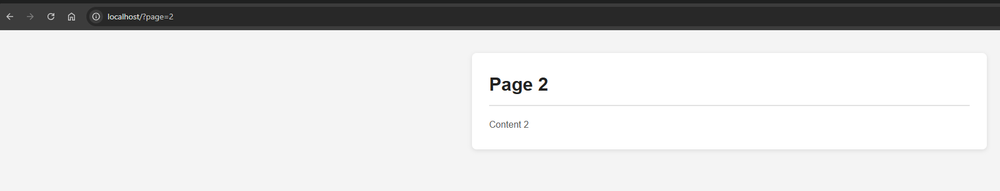
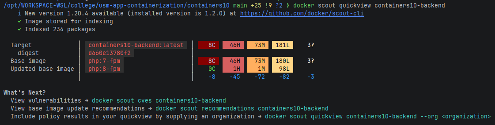

# Лабораторная работа №10. Управление секретами в контейнерах

## Цель работы

Знакомство с методами управления секретами в контейнерах.

## Задание

Создать многосервисное приложение с контейнерами, использующими секреты.

## Выполнение

### Структура проекта

Проект основан на лабораторной работе `containers08`. В него были внесены следующие изменения:

- **`Dockerfile`** — заменена установка расширения `pdo_sqlite` на `pdo_mysql`.
- **`site/modules/database.php`** — конструктор класса `Database` изменён: теперь принимает `$dsn`, `$username`,
  `$password` вместо пути к файлу SQLite.
- **`site/index.php`** — обновлён для использования нового конструктора с DSN для MySQL.
- **`site/config.php`** — настройки БД берутся из переменных окружения и файлов секретов.
- **`nginx.conf`** — конфигурация nginx взята из `containers07`.
- **`docker-compose.yaml`** — многосервисное приложение с секретами.
- **`secrets/`** — папка с файлами секретов (не хранится в репозитории).
- **`sql/schema.sql`** — схема базы данных, автоматически применяемая при старте контейнера.

### Секреты

Папка `secrets/` содержит три файла:

| Файл          | Описание                         |
|---------------|----------------------------------|
| `root_secret` | Пароль суперпользователя MariaDB |
| `user`        | Имя пользователя базы данных     |
| `secret`      | Пароль пользователя базы данных  |

Секреты монтируются в контейнеры по пути `/run/secrets/<имя>`.

### Инициализация базы данных

Для автоматического выполнения SQL-схемы при создании контейнера в сервис `database` был добавлен том:

```yaml
volumes:
  - ./sql/schema.sql:/docker-entrypoint-initdb.d/schema.sql
```

Образ MariaDB автоматически выполняет все `.sql`-файлы из директории `/docker-entrypoint-initdb.d/` при первом запуске
контейнера.

Кроме того, в файле `sql/schema.sql` была исправлена синтаксическая ошибка: `AUTOINCREMENT` (синтаксис SQLite) заменено
на `AUTO_INCREMENT` (синтаксис MySQL/MariaDB).

### Запуск

```bash
docker compose up -d --build
```

Страница сайта после запуска:



### Проверка безопасности образа

```bash
docker scout quickview containers10-backend
```



Команда `docker scout quickview` проанализировала образ `containers10-backend:latest` (234 пакета) и выявила **8
критических (C), 46 высоких (H), 73 средних (M), 181 низких (L)** уязвимостей. Большинство из них унаследованы от
базового образа `php:7-fpm`. Обновление базового образа до `php:8-fpm` устраняет 8 критических, 45 высоких, 72 средних и
82 низких уязвимости, что делает такое обновление настоятельно рекомендуемым.

## Ответы на вопросы

**Почему плохо передавать секреты в образ при сборке?**
Данные, переданные в образ во время `docker build` (через `ARG`, `ENV` или скопированные файлы), остаются в слоях образа
навсегда — даже если они впоследствии удалены командой `RUN rm`. Любой, кто получит доступ к образу (в том числе через
публичный реестр), сможет извлечь секреты с помощью `docker history` или анализа слоёв. Кроме того, секреты попадают в
кеш сборки и могут быть случайно опубликованы вместе с образом.

**Как можно безопасно управлять секретами в контейнерах?**
Существует несколько подходов:
- **Docker Secrets** — монтирует секреты как файлы в `/run/secrets/` внутри контейнера; не отображаются в метаданных.
- **Переменные окружения из внешних источников** — значения задаются в `.env`-файлах, которые не хранятся в
  репозитории.
- **Менеджеры секретов** (HashiCorp Vault, AWS Secrets Manager и др.) — централизованное безопасное хранилище с
  контролем доступа и ротацией секретов.
- **Монтирование файлов через тома** — файлы с паролями передаются в контейнер через `volumes`, минуя слои образа.

**Как использовать Docker Secrets для управления конфиденциальной информацией?**
В `docker-compose.yaml` секреты объявляются в секции `secrets` с указанием источника (файл или внешний):

```yaml
secrets:
  db_password:
    file: ./secrets/db_password

services:
  backend:
    secrets:
      - db_password
```

Внутри контейнера секрет доступен как файл `/run/secrets/db_password`. Приложение читает его содержимое, например:

```php
$password = trim(file_get_contents('/run/secrets/db_password'));
```

Таким образом, секрет никогда не попадает в переменные окружения, метаданные образа или историю команд.

## Выводы

В ходе работы было создано многосервисное приложение на основе `containers08` с использованием механизма секретов Docker
Compose. Секреты позволяют безопасно передавать чувствительные данные в контейнеры, не раскрывая их через переменные
окружения или образы. Класс `Database` был адаптирован для работы с MySQL через PDO, а конфигурация приложения считывает
учётные данные из файлов секретов, монтируемых в `/run/secrets/`. Для автоматической инициализации базы данных SQL-схема
монтируется в `/docker-entrypoint-initdb.d/`. Анализ образа с помощью `docker scout` показал наличие уязвимостей в
базовом образе `php:7-fpm`, устранимых обновлением до `php:8-fpm`.
